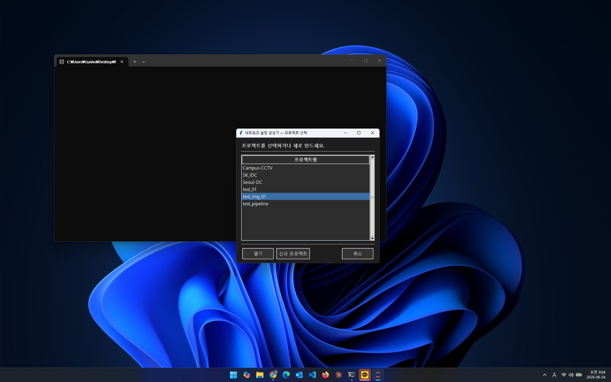
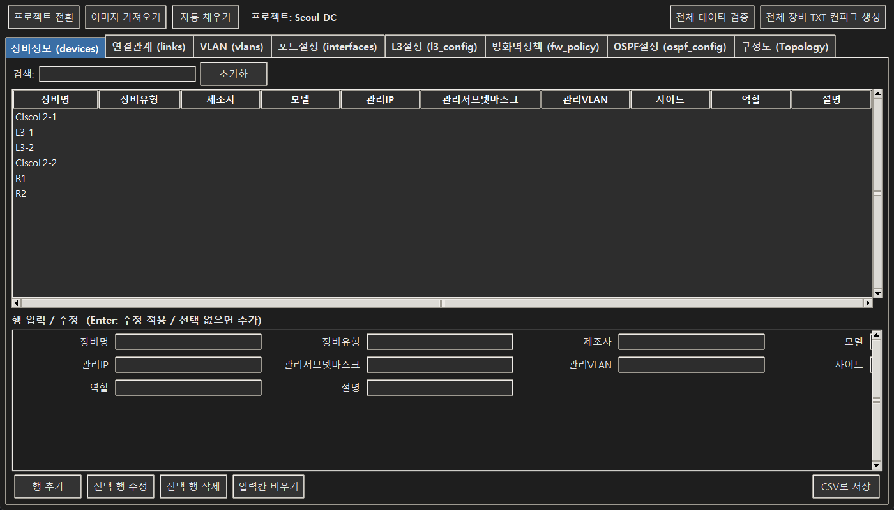
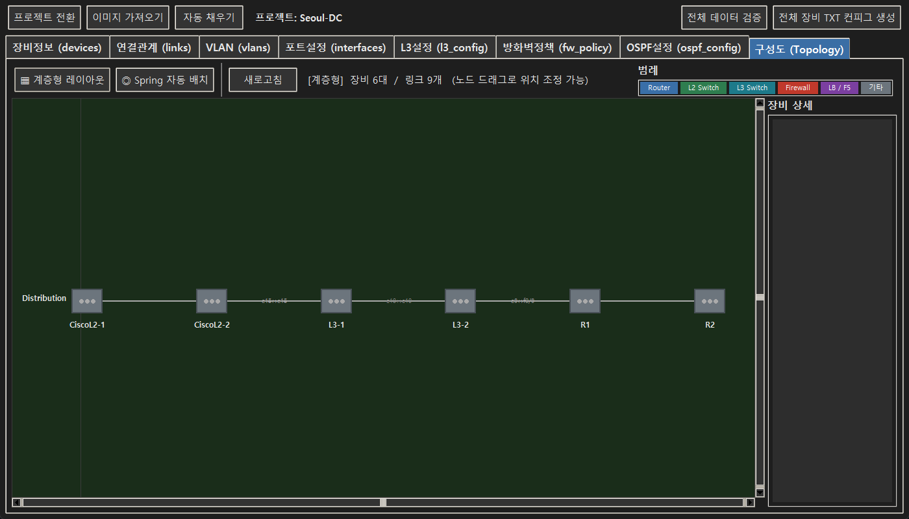
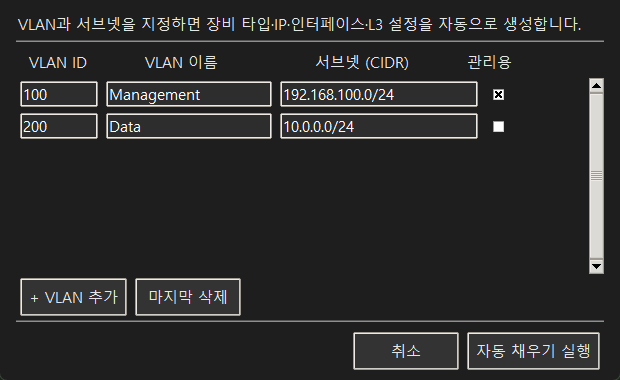
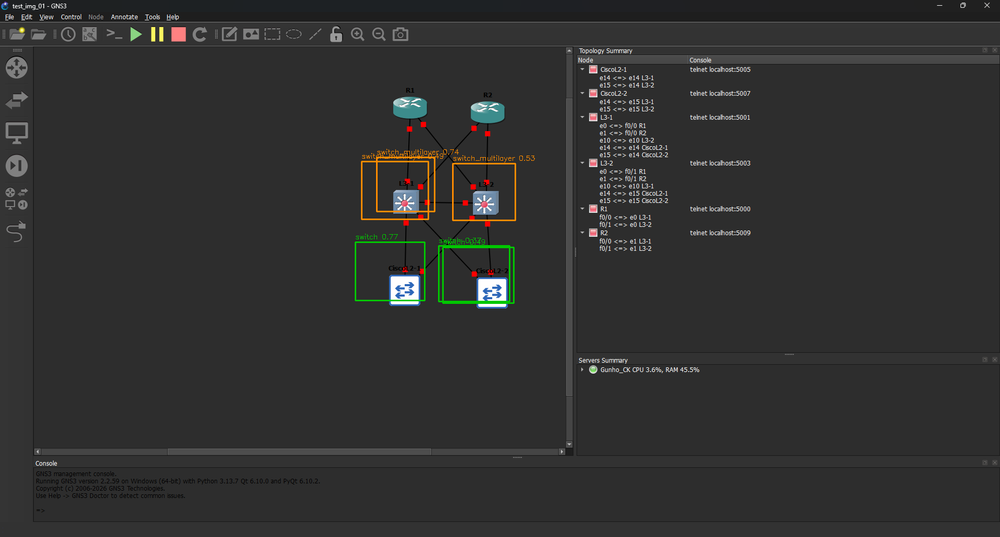

# net-ease

[](https://www.python.org/)
[]()
[]()
[]()
[]()
[]()

**GNS3 토폴로지 스크린샷 한 장으로 네트워크 장비 CLI 설정을 자동 생성하는 툴**

GNS3 화면을 캡처하면 OCR로 장비와 링크를 자동 인식하고,  
VLAN·서브넷만 지정하면 Cisco IOS / FortiGate CLI 설정 파일을 바로 뽑아줍니다.

---

## 스크린샷

### 0. 프로젝트 선택 / 신규 생성

<p align="center">
  
</p>

> 실행 시 기존 프로젝트를 선택하거나 새 프로젝트를 생성합니다.

---

### 1. 메인 화면 — CSV 편집기

<p align="center">
  
</p>

> 장비정보·연결관계·VLAN·포트설정·L3설정·방화벽정책·OSPF 7개 탭을 한 화면에서 편집합니다.

---

### 2. 구성도 뷰어

<p align="center">
  
</p>

> 계층형 / Spring 자동 배치 레이아웃을 지원하며, 노드를 드래그해 위치를 조정할 수 있습니다.

---

### 3. 자동 채우기 다이얼로그

<p align="center">
  
</p>

> VLAN ID·이름·서브넷만 입력하면 장비 타입 추론, 관리 IP 할당, 인터페이스·L3 설정을 자동 생성합니다.

---

### 4. YOLO 장비 검출 결과 (OCR fallback 파이프라인)

<p align="center">
  
</p>

> GNS3 Topology Summary 패널이 없을 경우 커스텀 학습된 YOLOv26 모델이 장비를 직접 검출합니다.  
> L2 Switch / L3 Switch 클래스별 바운딩 박스와 신뢰도 점수를 출력합니다.

---

## 주요 기능

| 기능 | 설명 |
|------|------|
| **이미지 가져오기** | GNS3 스크린샷 → OCR로 장비명·연결 관계 자동 추출 |
| **자동 채우기** | VLAN·서브넷 입력 → 장비 타입·IP·인터페이스·L3 설정 자동 생성 |
| **CLI 컨피그 생성** | 장비별 Cisco IOS / FortiGate CLI 설정 파일 (.txt) 출력 |
| **구성도 뷰어** | 계층형 / Spring 레이아웃 토폴로지 시각화, 노드 드래그 가능 |
| **CSV 편집기** | 7개 데이터 탭 (장비·링크·VLAN·인터페이스·L3·방화벽·OSPF) |
| **데이터 검증** | IP 형식, VLAN 범위, 키 참조 일관성 자동 검사 |

---

## 동작 흐름

```
GNS3 스크린샷
      │
      ▼
 [이미지 가져오기]
  Topology Summary OCR → devices.csv, links.csv 자동 생성
  (Summary 패널 없으면 YOLO 객체 검출 fallback)
      │
      ▼
 [자동 채우기]
  VLAN ID / 이름 / 서브넷 입력
  → 장비 타입 추론 (R1→Router, L3-1→L3 Switch ...)
  → 관리 IP 순차 할당
  → interfaces.csv, l3_config.csv 자동 생성
      │
      ▼
 [전체 장비 TXT 컨피그 생성]
  Cisco IOS / FortiGate CLI → projects/<name>/output/*.txt
```

---

## 지원 벤더

| 장비 타입 | 벤더 | 생성 설정 |
|-----------|------|-----------|
| Router | Cisco | Interface, Static Route, OSPF |
| L3 Switch | Cisco | VLAN, SVI, Trunk, HSRP/GLBP, OSPF |
| L2 Switch | Cisco | VLAN, Trunk, Access Port |
| Firewall | Fortinet | Interface, Static Route, Address, Policy, NAT |

---

## 설치

### 요구사항

- Python 3.10+
- CUDA 지원 GPU (OCR 가속, CPU 동작도 가능)

### 패키지 설치

```bash
pip install pandas easyocr ultralytics opencv-python torch pillow
```

### YOLO 모델

`VS_Code/best.pt` 경로에 커스텀 학습된 네트워크 장비 검출 모델을 배치합니다.  
(Router / L2 Switch / L3 Switch 3-class YOLOv26 모델)

> `VS_Code/` 폴더는 프로젝트 루트 또는 부모 디렉터리에 위치하면 자동으로 탐색합니다.

---

## 실행

```bash
python main.py
```

1. 프로젝트 선택 또는 신규 생성
2. **이미지 가져오기** — GNS3 스크린샷 선택
3. **자동 채우기** — VLAN과 서브넷 입력
4. 필요한 경우 각 탭에서 데이터 수동 보완
5. **전체 장비 TXT 컨피그 생성** 클릭

---

## 프로젝트 구조

```
net-ease/
├── main.py                  # GUI 진입점 (tkinter)
├── config_generator.py      # Cisco / FortiGate CLI 생성 로직
├── auto_fill.py             # 장비 타입 추론 + IP/인터페이스 자동 생성
├── validator.py             # 데이터 검증
├── topology.py              # 구성도 캔버스 (GNS3 스타일 아이콘)
├── column_labels.py         # CSV 컬럼명 → 한글 라벨 매핑
├── topology_pipeline/
│   ├── pipeline.py          # OCR 우선 / YOLO fallback 파이프라인
│   ├── topo_summary.py      # GNS3 Topology Summary 패널 OCR 파서
│   ├── detector.py          # YOLO 장비 검출
│   ├── ocr.py               # EasyOCR 레이블 추출
│   ├── line_tracer.py       # Hough 연결선 추적
│   ├── csv_writer.py        # 검출 결과 → CSV
│   └── runner.py            # subprocess 진입점 (GUI → 파이프라인)
└── projects/
    └── <project-name>/
        ├── dataset/         # 입력 CSV 7종
        └── output/          # 생성된 CLI 설정 파일
```

---

## CSV 데이터 구조

프로젝트별로 `dataset/` 폴더 안에 7개 CSV를 관리합니다.

| 파일 | 주요 컬럼 |
|------|-----------|
| `devices.csv` | device_name, device_type, vendor, mgmt_ip, mgmt_vlan |
| `links.csv` | device_a, port_a, device_b, port_b, link_type |
| `vlans.csv` | vlan_id, vlan_name, purpose |
| `interfaces.csv` | device_name, port_name, mode, access_vlan, trunk_allowed_vlans |
| `l3_config.csv` | device_name, config_type, vlan_id, ip_address, routing_protocol |
| `fw_policy.csv` | policy_id, src_intf, dst_intf, src_subnet, action, nat_enable |
| `ospf_config.csv` | device_name, ospf_process_id, interface_name, area_id |

> CSV 컬럼명은 영문으로 유지하고, GUI 표시만 한글로 처리합니다 (`column_labels.py`).
